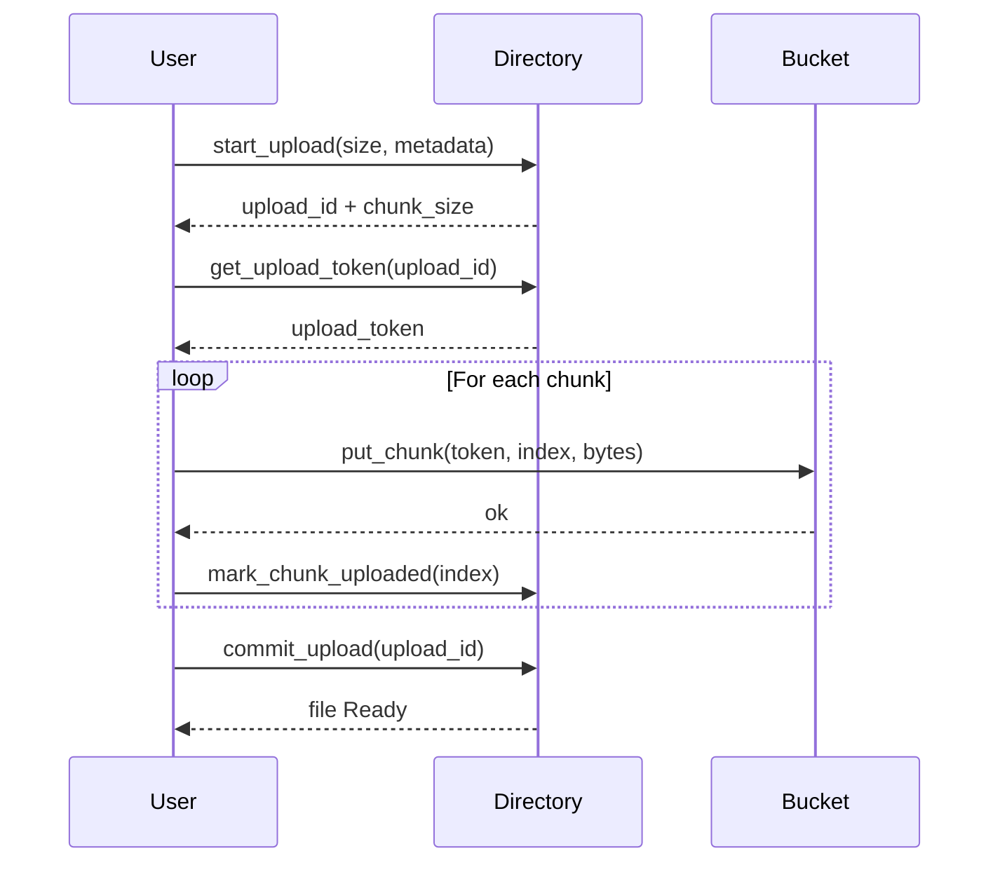
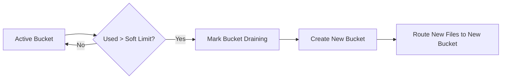

## 🔷 High-Level Architecture Diagram

```mermaid
flowchart TB
    User[User / Frontend]

    subgraph ControlPlane["Directory Canister (Control Plane)"]
        DirAccounts[User Accounts & Credits]
        DirMeta[File Metadata & Index]
        DirUploads[Upload Sessions]
        DirRouting[Bucket Routing]
    end

    subgraph DataPlane["Bucket Canisters (Data Plane)"]
        Bucket1[(Bucket A)]
        Bucket2[(Bucket B)]
        BucketN[(Bucket N)]
    end

    subgraph Ops["Operations"]
        Billing[Credit / Cycles Billing]
        Admin[Monitoring & Admin]
    end

    User -->|start_upload| DirUploads
    User -->|get_pricing / usage| DirAccounts
    User -->|commit_upload| DirUploads
    User -->|list_files| DirMeta

    DirRouting --> Bucket1
    DirRouting --> Bucket2
    DirRouting --> BucketN

    User -->|put_chunk (token)| Bucket1
    User -->|get_chunk| Bucket1

    Bucket1 -->|stat / usage| DirRouting

    Billing --> DirAccounts
    Admin --> DirRouting
```

## 🔷 Upload Sequence Diagram



## 🔷 Bucket Provisioning Logic (Shard Growth)


