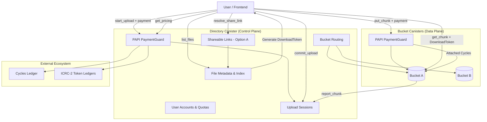
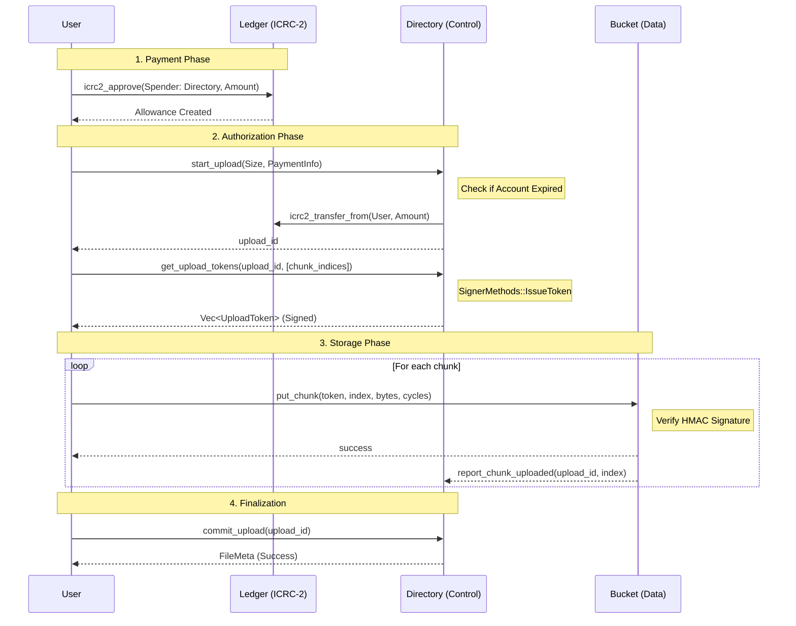
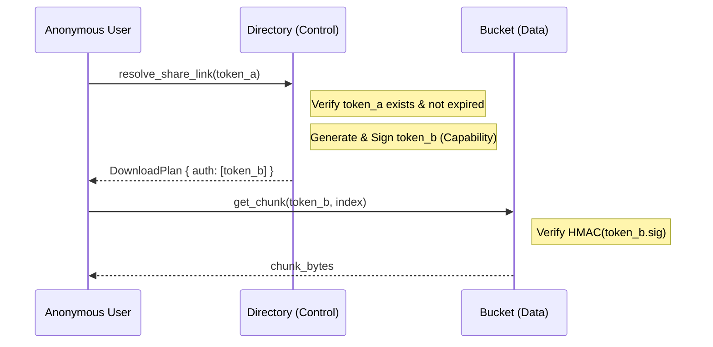
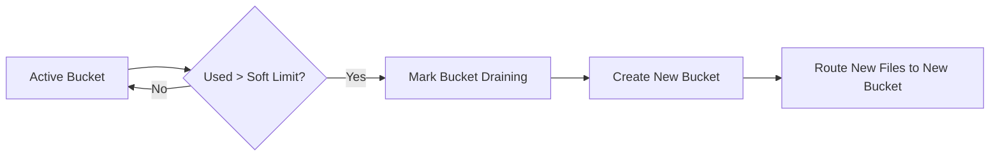

## 🔷 High-Level Architecture Diagram

## 🔷 Payment Logic (PAPI)

Payment logic is modularised into `payments.rs` in each canister, using the **PAPI (Paid APIs)** library.

- **Directory (Control Plane)**: Enforces fees for metadata operations and manages the **Rent Model**. It tracks a user's `expires_at_ns` and `prepaid_balance`.
- **Bucket (Data Plane)**: Enforces storage fees for `put_chunk`. Now supports both **Attached Cycles** and **ICRC-2 Tokens** (ICP/ckUSDC), ensuring that bucket canisters are refueled directly by the users.

### Rent Model & Garbage Collection

The Directory canister uses a `canister_heartbeat` to periodically run a `garbage_collect` task.

- **Expiry**: When `time() > expires_at_ns + 30 days`, the user's account and all associated files are deleted.
- **Top-Up**: Users can extend their expiration by calling `top_up_balance`.

## 🔷 Upload Sequence Diagram (Complete Flow)

## 🔷 Link Sharing (Capability-Based)

Vault Core uses a two-layer token system for secure, decentralized file access:

### Two-Layer Token Mechanism

1.  **Option A (Shareable Link)**: A 256-bit random, unguessable token stored in the `LINKS` stable map of the Directory canister. It maps to a `FileId` and has a TTL. Useful for public/semi-public sharing.
2.  **Option B (Download Capability Token)**: An HMAC-SHA256 signed structure containing `{ file_id, bucket_id, directory_id, expires_at }`. This is generated by the Directory upon resolution of an Option A link or directly for authorized ACL users.
3.  **Decentralized Verification**: The Bucket canister verifies the signature of the Option B token using a shared secret. This allows the Bucket to serve chunks without calling the Directory for every request.

### Link Resolution Sequence

## 🔷 Bucket Provisioning Logic (Shard Growth)

## 🔷 Testing Infrastructure

The system's integrity is verified via a centralized integration test suite using `PocketIC`. These tests simulate the entire sharded environment, including the inter-canister interactions between the Directory and Buckets, as well as the cycle-based billing logic.

For technical details on the test architecture, see [HACKING.md](file:///Users/antonio.ventilii/projects/vault-core/HACKING.md).
