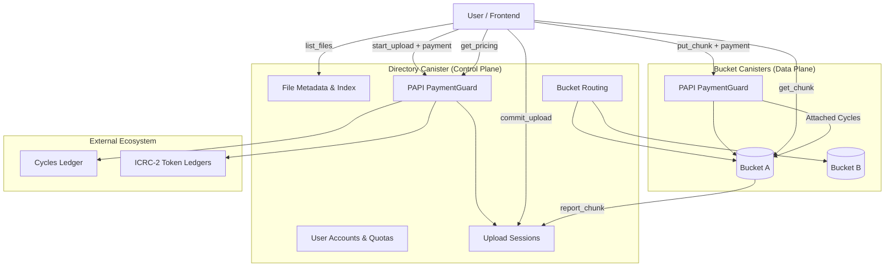
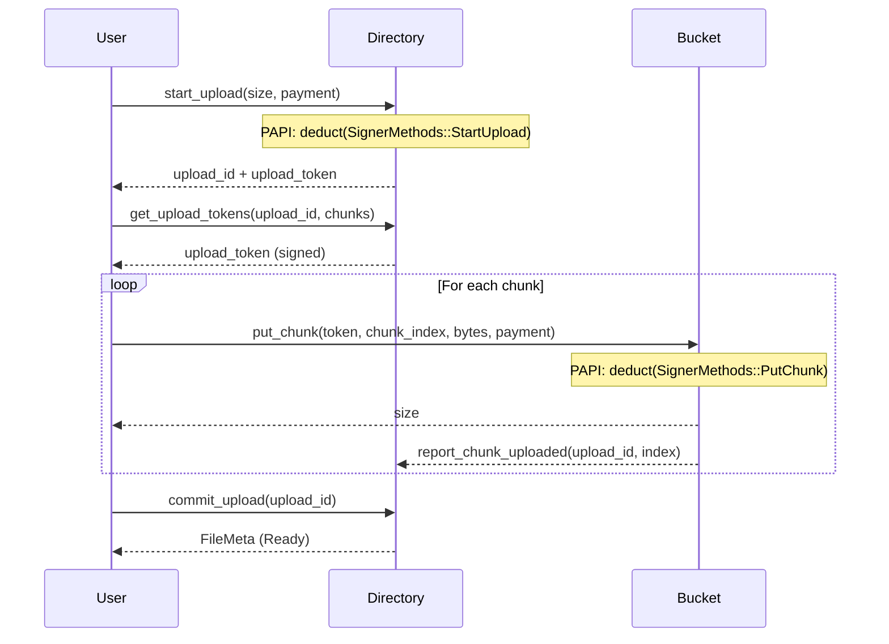
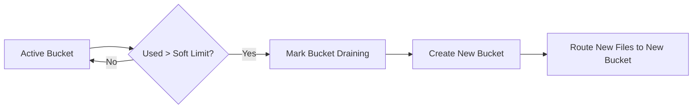
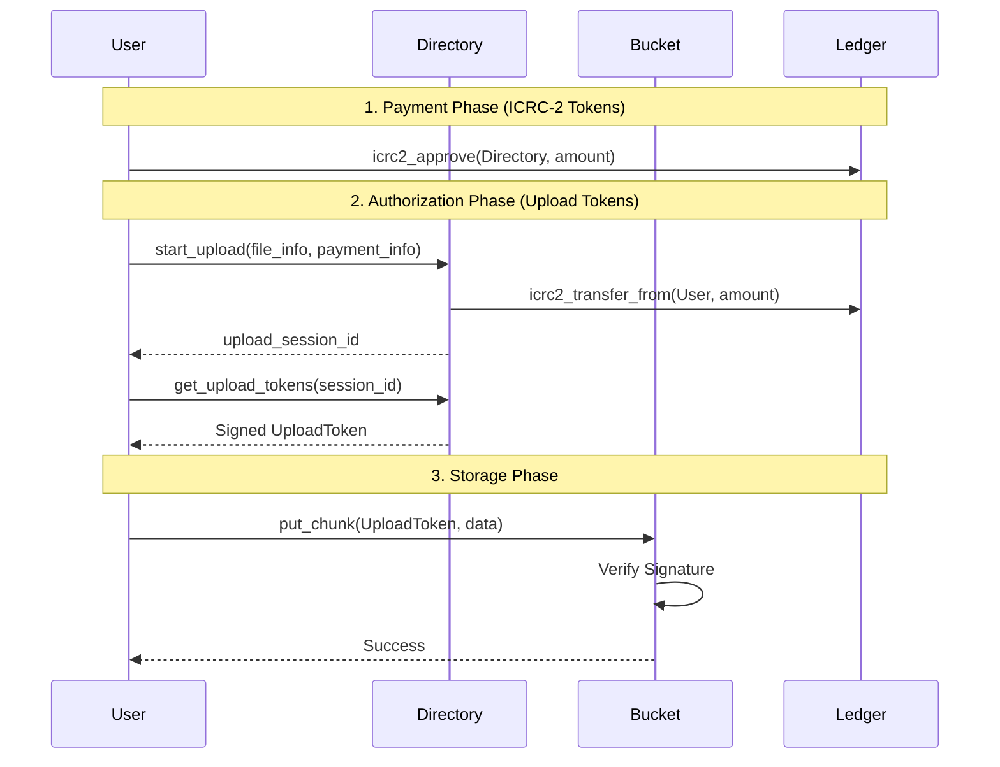

## 🔷 High-Level Architecture Diagram

## 🔷 Payment Logic (PAPI)

Payment logic is modularised into `payments.rs` in each canister, using the **PAPI (Paid APIs)** library.

- **Directory (Control Plane)**: Enforces fees for metadata operations (e.g., starting an upload). Supports Cycles (direct or via Ledger) and ICRC-2 Tokens.
- **Bucket (Data Plane)**: Enforces "attached cycles" for data-heavy operations (`put_chunk`). This ensures that bucket canisters are refueled directly by the users, preventing resource exhaustion during large uploads.

## 🔷 Upload Sequence Diagram

## 🔷 Bucket Provisioning Logic (Shard Growth)

## 🔷 Visual Flow

