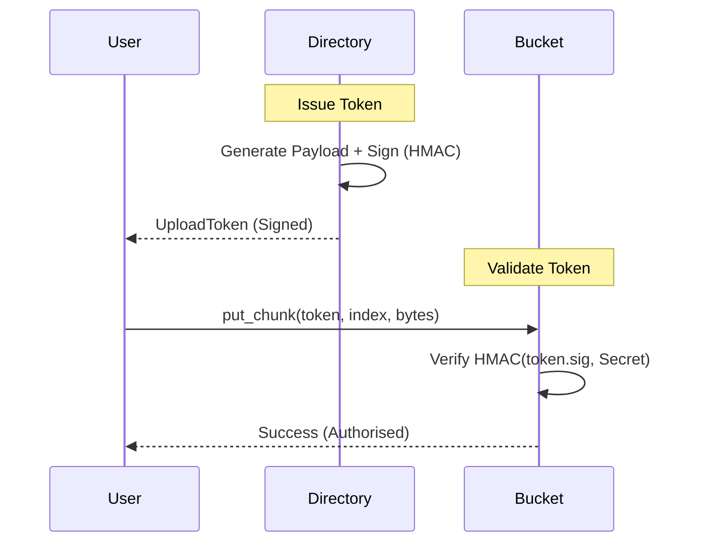

# 🔑 Upload Tokens (Authorization)

Vault Core uses a **Capability-based Security** model for sharded file storage. Since metadata is managed by the **Directory** and data is stored in **Buckets**, a secure hand-off mechanism is required.

---

## 🔷 Purpose

Upload Tokens are short-lived, cryptographically signed "permits" issued by the Directory canister that authorize a user to upload specific data chunks to a specific Bucket.

---

## 🔷 Flow

1. **Request:** A user calls `directory.start_upload()` (and pays via PAPI).
2. **Issuance:** A user calls `directory.get_upload_tokens()`. The Directory identifies a target Bucket and issues a signed token.
3. **Execution:** The user calls `bucket.put_chunk(token, chunk_index, bytes)`.
4. **Validation:** The Bucket verifies the token's signature and constraints before accepting the data.

---

## 🔷 Interaction Diagram (Security Hand-off)



> [!TIP]
> For the complete end-to-end flow including payments and finalization, see the [Upload Sequence Diagram](file:///Users/antonio.ventilii/projects/vault-core/ARCHITECTURE.md#L53-L80) in ARCHITECTURE.md.

---

## 🔷 Data Structure

Defined in `src/shared/src/types.rs`:

```rust
pub struct UploadToken {
    pub upload_id: Vec<u8>,
    pub file_id: FileId,
    pub bucket_id: Principal,
    pub directory_id: Principal,
    pub expires_at: u64,
    pub allowed_chunks: Vec<u32>,
    pub sig: Vec<u8>,
}
```

---

## 🔷 Cryptography (v1)

In the current version, tokens are signed using **HMAC-SHA256** with a shared secret.

- **Implementation:** `src/shared/src/auth.rs`
- **Verification:** Buckets verify the integrity of the `upload_id`, `file_id`, `bucket_id`, and `allowed_chunks` using the signature.

> [!WARNING]
> In production, this symmetric secret should be replaced by **Threshold Signatures** (ECDSA/Schnorr) so that Buckets only require a Public Key for verification.
